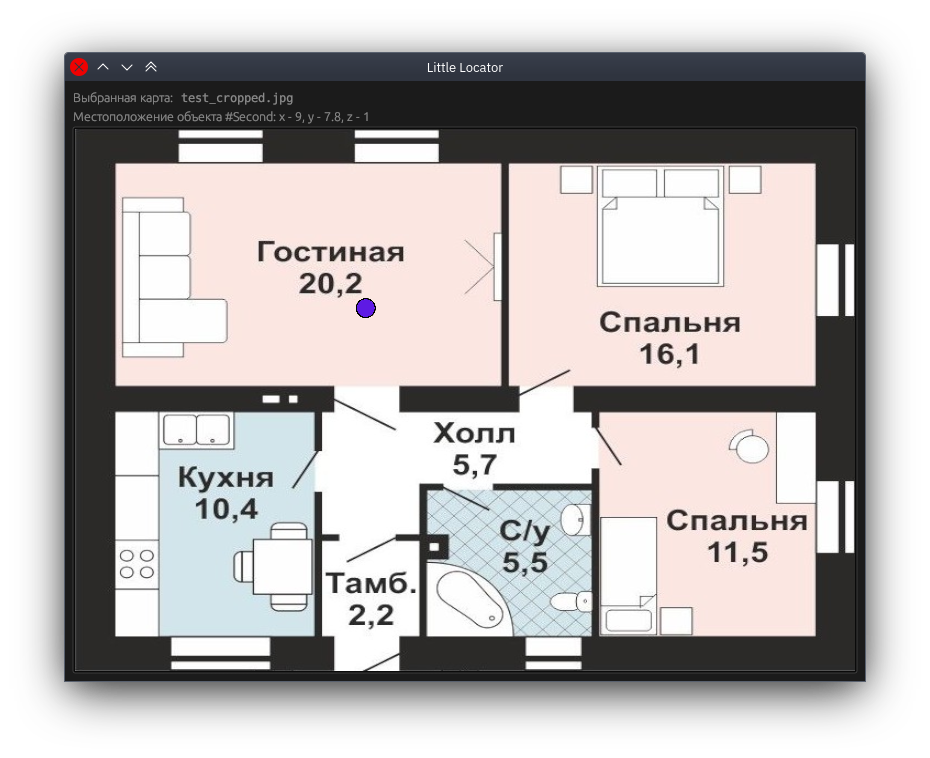

# little-locator



Приложение для простейшего проецирования геопозиций меток на карту здания.

**Возможности:**

1. Отображение меток
2. Отображение истории перемещений
3. Отсечение истории перемещений по времени
4. Поддержка конфигурирования

Чтобы отобразить новую позицию, отправьте POST-запрос на `localhost:5800` с JSON вида:

```json
{
  "id": "Метка №1",
  "x": 16.0,
  "y": 12.0,
  "z": 1.0
}
```

**Убедитесь,** что масштаб при выборе картинки задан корректно.

Чтобы отобразить карту с заранее выбранными параметрами, поместите в папку `backend` файл `config.json` следующего вида:

```json
{
  "image_filepath": "../frontend/assets/test_cropped.jpg",
  "length": 25.0,
  "width": 25.0,
  "anchors": [
    {
      "x": 3.0,
      "y": 3.0,
      "z": 1.0
    },
    {
      "x": 22.0,
      "y": 3.0,
      "z": 1.0
    }
  ]
}
```

Путь указывается **относительно** папки `backend`.

## Подготовка к сборке

Установите `rustup`, затем выполните:

```bash
curl https://sh.rustup.rs -sSf | sh
rustup target add wasm32-unknown-unknown
cargo install --locked trunk
```

## Сборка фронтенда

```bash
cd little-locator/frontend
trunk build --release
```

## Сборка бэкенда

```bash
cd little-locator/backend
cargo build --release
```

## Запуск

```bash
cd little-locator/backend
cargo run --release
```

Сервер будет запущен на порту `5800`. [Переход в Web-UI](http://127.0.0.1:5800)
