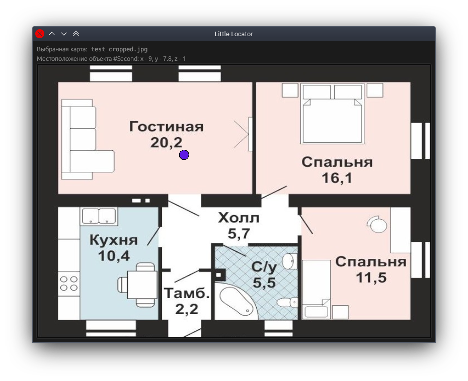

# little-locator



Приложение для простейшего проецирования геопозиций меток на карту здания.

Чтобы отобразить новую позицию, отправьте POST-запрос на `localhost:5800` с JSON вида:

```json
{
  "id": "Метка №1",
  "x": 16.0,
  "y": 12.0,
  "z": 1.0
}
```

**Убедитесь,** что масштаб при выборе картинки задан корректно.

## Подготовка к сборке

Установите `rustup`, затем выполните:

```bash
rustup install stable
```

## Сборка

```bash
cd little-locator
cargo build --release
```

## Запуск

```bash
cargo run --release
```
